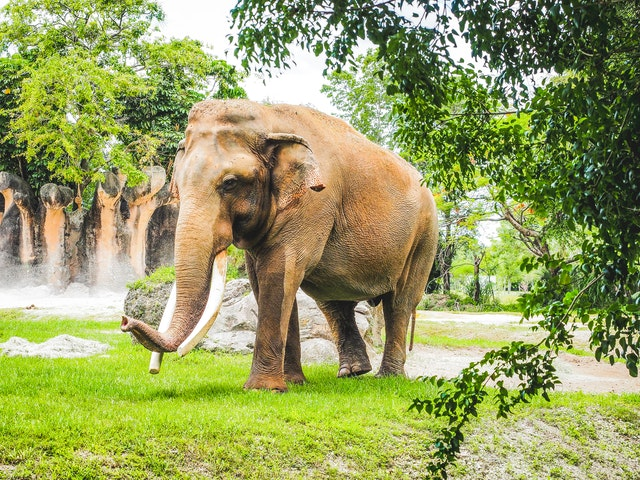

<h1 align="center">Zoo Directory Ireland </h1>

Zoo Directory Ireland was a site designed to give users 
all of the relative information about how to find zoo's in ireland and extra helps and tips on how to get there as well as opening and closing times. The site aims to target tourists and familys looking for information all in one place.

<h2> Features </h2>
The site features a navigation bar with 4 pages home, gallery, sign up, and info. the home button was designed so users could get back to the home page with ease. the info page has all the information needed for the zoo's opening, closing times, prices and location as well as how to get there. the gallery page has a list of photos of the different animals you can expect to see in each zoo. The sign up page is designed for users to sign up and get a newsletter for any upcoming changes to the zoo's such as changes to opening times or new animals.

<h3>The home page</h3>
It was designed as a simple and eye catching with 3 circular images in the center and titles to each of the zoo's and about us section at the bottom as well as links to our twitter,facebook, instagram and youtube accounts. A menu also appears in the center.

<h3>The Info Page</h3>
I designed it to be quick and effiecient with 3 rows of information columns so the user could easily get the information quick.

<h3>The gallery page </h3> 
just has a few different images of the kind of animals you could expect to see at a zoo.

<h3>The sign up page</h3>
Has a working sign up button and a nice background image that compliments the page.

<h2>Testing</h2>
<li>This site features a menu stystem with 4 links to 4 pages, a sign up feature and  links to social media. I have contionusly tested that all these work throughout the project and can confirm all are working as intended.<li>

<li>The website also was tested on https://www.responsinator.com/ and google developer tools to make sure that the website worked on different phone screens and ipads/android tablets.</li>

<h3>Validator Testing</h3>
<ol>
<li> HTML- No errors</li>
<li> CSS - No errors</li>
</ol>

<h2>Deployment<h2>
I used github pages to deploy my project by going to settings on my repositories then on the left menu i clicked Pages, from there i selected main from the drop down and clicked save.

<h2>Credits:</h2>

<h3>Content</h3>
<ol>For the text underneath the 3 images i used  a little bit of the text in the about us section of each of the zoos.
The links are:</ol>
<li>https://www.dublinzoo.ie/about/</li>
<li>https://www.fotawildlife.ie/about-us/</li>
<li>http://www.belfastzoo.co.uk/about-us/about.aspx</li>
The about us section text I wrote myself.
For the times,prices and locations i used each of these websites also.
The code for the social media links i took from the love running project.
I also reused the city icons from love running because it went well with the design and Dublin,Belfast are cities, the camera icon was used for Cork zoo.
My home page was a bit of a mess at the start and my mentor helped me fix it and make it more organised. The structure of my website was messing wih the rest of the page. He helped me with organising the code above the three centered images of Dublin,cork and belfast zoo.

<h3>Media</h3>
<li>
All the images were taken from https://www.pexels.com/</li>
<li>Font awesome was used for icons</li>
<li>I used google fonts to change the font.</li>

<h2>Acknowledgement</h2>

Thanks to my mentor for helping me and explaining things more clearly and putting me on the right track with the structure of my home page and also for helping me understand the media querys and writing the code for the small screens.

